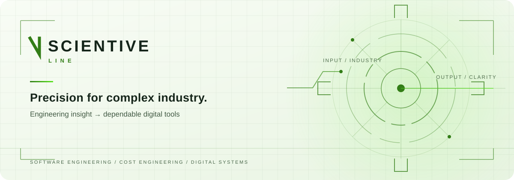

<picture>
  <source media="(prefers-color-scheme: dark)" srcset="./scientive-hero-dark.svg">
  <source media="(prefers-color-scheme: light)" srcset="./scientive-hero-light.svg">
  
</picture>

# Engineering meets code.

We are **Scientive Line**, an engineering-led industrial software company. We turn complex production and cost challenges into clear, dependable digital tools — from specialized products to software built around your operation.

**[Explore our solutions](https://scientiveline.com/solutions)** · **[See our work](https://scientiveline.com/portfolio)** · **[Talk to us](https://scientiveline.com/contact)**

## Built for decisions that matter

| | |
| :--- | :--- |
| **Cost engineering** | Faster, more consistent calculations for industrial processes and production decisions. |
| **Custom software** | Digital ecosystems shaped around real workflows, with simplicity at the interface. |
| **Technical consulting** | Industrial experience and software thinking applied to process and cost challenges. |

### The workbench

- **OmniumC** — automates cycle-time and operating-cost calculations to support more reliable costing.
- **OmniumS** — makes visual capture and technical documentation quicker and clearer.
- **OmniumCAD** — connects 3D geometry with technical evaluation and costing workflows.
- **Schmale FrontPage** — brings everyday tools and resources into one organized workspace.

[Explore the portfolio →](https://scientiveline.com/portfolio)

---

### Start a conversation

Have an industrial software, cost engineering, or product development challenge? **[Tell us what you are working on](https://scientiveline.com/contact).**

[Website](https://scientiveline.com) · [LinkedIn](https://www.linkedin.com/company/scientive-line/) · [YouTube](https://www.youtube.com/@ScientiveLine) · [Public repositories](https://github.com/orgs/scientiveline-lda/repositories)

Based in São João da Madeira, Portugal · Inventive science, practical engineering.
